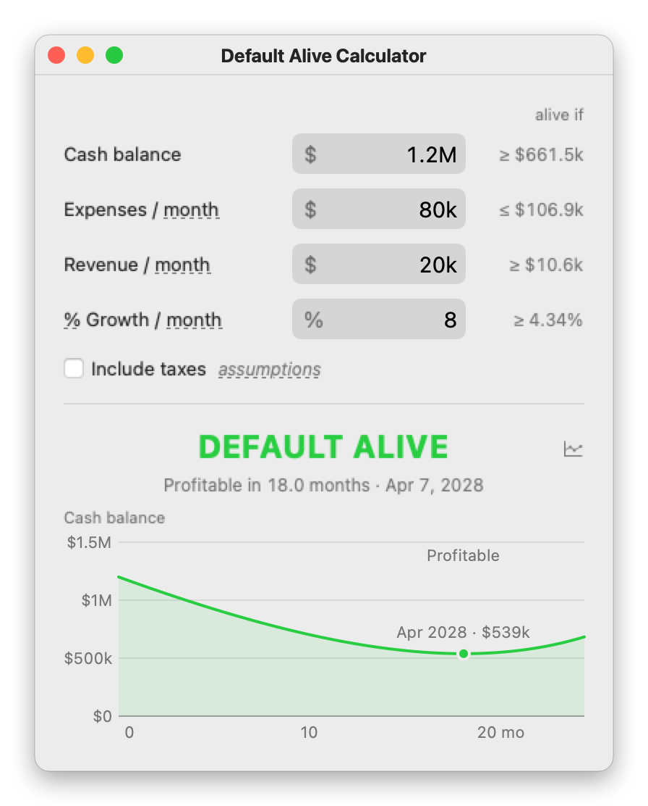
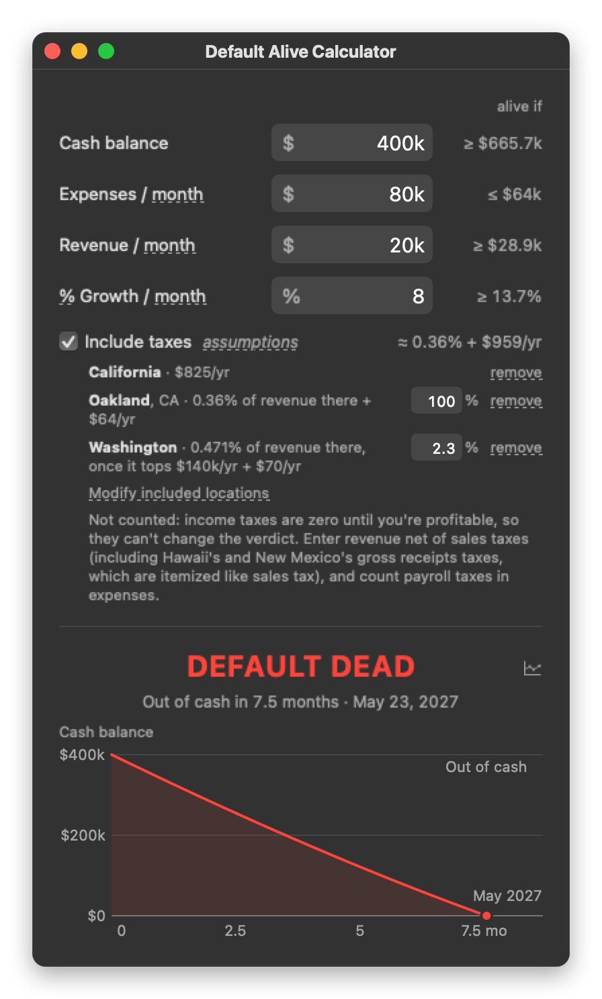

# Default Alive Calculator

A small Mac app for Paul Graham's question in [Default Alive or Default Dead?](https://paulgraham.com/aord.html): if expenses stay flat and revenue keeps growing at its recent rate, do you reach profitability before the money runs out?

<p>
  
  
</p>

## Install

Needs macOS 14 or later and Apple's command line tools (run `xcode-select --install` if you don't have them).

```sh
git clone https://github.com/rickardstureborg/default-alive-calc
cd default-alive-calc
make install
```

This builds the app, puts it in `~/Applications`, and opens it. `make uninstall` removes it along with its saved input.

## Use

- Enter cash, expenses, revenue and growth. Boxes accept `250k`, `$1.2M`, even `163+5`.
- Click **month** to switch between week, month and year. Click **%** to use flat dollar growth instead.
- **alive if** shows what each number would need to be on its own. Leave one box empty and the app solves for it.
- Drag the dot on the chart to try a different growth rate.
- **Include taxes** subtracts the taxes owed before profit in the states and cities you pick.
- **Esc** or **C** clears everything. Only your last input is saved.

## How it decides

Revenue compounds from today, so it overtakes expenses after `T = ln(E/R) / ln(1+g)` months, and the cash burned until then is `E·T − (E−R) / ln(1+g)`. You're default alive if you have that much cash. This is [Trevor Blackwell's calculator](https://growth.tlb.org) with expenses held flat, and the tests check against its numbers.

Tax rates come from official state and city sources, researched in October 2026 ([details](docs/DEVELOPING.md#tax-data)). They're estimates, not tax advice.

## Development

See [docs/DEVELOPING.md](docs/DEVELOPING.md).
